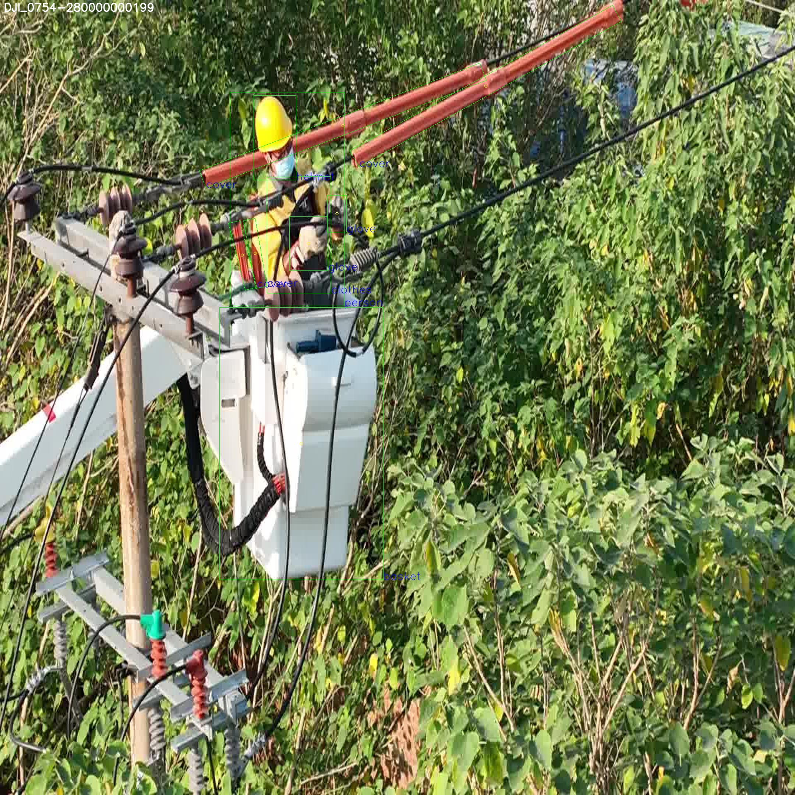

## Usage Example
`1.` `'Get Dataset' `
 
* Split the DOTA_OBB image and labels. Trans DOTA format to YOLO longside format.

* You can refer to  [hukaixuan19970627/DOTA_devkit_YOLO](https://github.com/hukaixuan19970627/DOTA_devkit_YOLO).

* The Oriented YOLO Longside Format is:

```
$  classid    x_c   y_c   longside   shortside    Θ    Θ∈[0, 180)


* longside: The longest side of the oriented rectangle.

* shortside: The other side of the oriented rectangle.

* Θ: The angle between the longside and the x-axis(The x-axis rotates clockwise).x轴顺时针旋转遇到最长边所经过的角度
```
`WARNING: IMAGE SIZE MUST MEETS 'HEIGHT = WIDTH'`


`2.` `'train.py'` 

* All same as [ultralytics/yolov5](https://github.com/ultralytics/yolov5).  You better train demo files first before train your custom dataset.
* Single GPU training:
```
$ python train.py  --batch-size 4 --device 0
```
* Multi GPU training:  DistributedDataParallel Mode 
```
python -m torch.distributed.launch --nproc_per_node 4 train.py --sync-bn --device 0,1,2,3
```


`3.` `'detect.py'` 
    
```
$  python detect.py 
```





